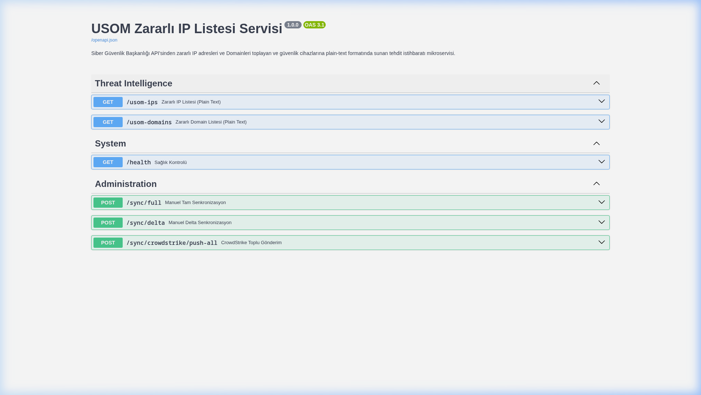
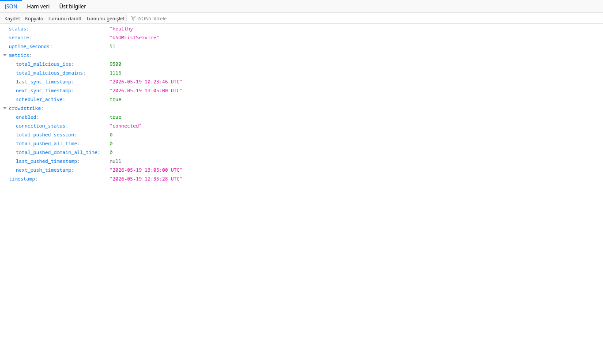

# 🛡️ USOM Threat Intelligence Feed Service — API to Plain Text (EDL) & Güvenlik Ürünleri Entegrasyonu

USOM (Ulusal Siber Olaylara Müdahale Merkezi), zararlı bağlantılar listesini (IP ve Domain) 1 Haziran 2026 itibarıyla statik `.txt` dosyası yerine sadece **API** üzerinden sunmaya başlayacaktır.

**USOM List Service**, doğrudan karmaşık API entegrasyonu (özellikle sayfalama, rate-limit vb. özellikleri) desteklemeyen, **External Dynamic List (EDL)** olarak sadece düz metin (plain text) formatındaki IP ve Domain listelerini tüketebilen Güvenlik Duvarı (Palo Alto, Fortinet vb.), WAF ve Mail Gateway'ler için geliştirilmiş **açık kaynaklı, yüksek performanslı bir ara katmandır (middleware)**.

## ✨ Öne Çıkan Özellikler

- **Kesintisiz Cihaz Entegrasyonu:** Güvenlik cihazlarınız, konfigürasyon değişikliğine gerek duymadan `http://sunucu_ip:8000/usom-ips` üzerinden geleneksel formattaki (CR-LF satır sonu) listeyi çekebilir.
- **Akıllı Senkronizasyon (Delta & Full):** APScheduler kullanılarak oluşturulan arka plan görevleri ile veri çekim işlemleri tam otomatik hale getirilmiştir.
  - *IP Saatlik Delta Sync:* Yalnızca yeni eklenen IP adreslerini çekerek API limitlerini yormaz. (Her saatin 5. dakikasında çalışır).
  - *Domain Saatlik Delta Sync:* Yalnızca yeni eklenen Domain adreslerini çeker. (Her saatin 10. dakikasında çalışır).
  - *IP Haftalık Full Sync:* Veritabanı tutarlılığını sağlamak için baştan sona tüm IP listesini kontrol eder. (Her Pazar gecesi 03:00'te çalışır).
  - *Domain Haftalık Full Sync:* Baştan sona tüm Domain listesini senkronize eder. (Her Pazar gecesi 04:00'te çalışır).
  - *Veri Çekim Düzeni (Rate Limit Koruması):* USOM API'sinin kısıtlamalarına takılmamak adına eşzamanlı HTTP istek sayısı (Semaphore) limitlenmiş ve başarısız isteklere karşı üstel bekleme (exponential backoff retry) mekanizması eklenmiştir. Delta (saatlik) senkronizasyonlarda, sayfalar taranırken daha önceden veritabanında olan bir kayda rastlandığında gereksiz API çağrısı yapmamak için işlem erken sonlandırılır (early stop).
- **CrowdStrike Falcon Entegrasyonu (Opsiyonel):** USOM'dan çekilen zararlı IP ve Domain'leri asenkron olarak CrowdStrike IOC veritabanına otomatik basar. (Whitelist özelliği ile false-positive'leri engeller).
- **Yüksek Performans:** Python FastAPI, `aiosqlite` (Async SQLite) ve `httpx` kullanılarak asenkron mimaride geliştirilmiştir.

## 🛠️ Kurulum

Projeyi Linux sunucunuzda sanal ortam (virtual environment - venv) kullanarak ayağa kaldırmak için aşağıdaki adımları takip edebilirsiniz.

### 1. Depoyu Klonlayın ve Klasöre Geçin

```bash
git clone https://github.com/emreefedogan/SGB-USOMFeedService.git
cd SGB-USOMFeedService
```

### 2. Python ve Sanal Ortam (venv) Kurulumu

Gerekli Python paketlerinin sistem genelini etkilememesi için bir sanal ortam oluşturun. Kullanmakta olduğunuz Linux dağıtımına göre gerekli paketleri yükleyin:

**Debian / Ubuntu:**
```bash
sudo apt update && sudo apt install -y python3 python3-venv python3-pip
```

**Arch Linux:**
```bash
sudo pacman -Syu python python-pip
```

**RedHat / CentOS / Fedora:**
```bash
sudo dnf install -y python3 python3-pip
```

Ardından sanal ortamı oluşturup aktif edin:

```bash
# Sanal ortamı oluşturun
python3 -m venv venv

# Sanal ortamı aktif edin
source venv/bin/activate
```

### 3. Bağımlılıkları Yükleyin

```bash
pip install --upgrade pip
pip install -r requirements.txt
```

### 4. Yapılandırma Dosyasını Hazırlayın

Ortam değişkenleri dosyasını kopyalayın ve düzenleyin (CrowdStrike entegrasyonu kullanacaksanız Falcon API bilgilerini girin, istemiyorsanız boş bırakabilirsiniz):

```bash
cp .env.example .env
nano .env
```

### 5. Uygulamayı Başlatın

Uygulamayı uvicorn ile başlatarak test edebilirsiniz:

```bash
uvicorn main:app --host 0.0.0.0 --port 8000
```
Servis `http://<sunucu_ip>:8000` portundan yayına başlayacaktır.

---

## 🖥️ Systemd Servisi Olarak Arka Planda Çalıştırma

Uygulamanın sunucu yeniden başladığında otomatik açılması ve arka planda sürekli çalışması için bir Systemd servis dosyası oluşturabilirsiniz.

1. `/etc/systemd/system/usom-feed.service` dosyasını oluşturun:

```bash
sudo nano /etc/systemd/system/usom-feed.service
```

2. Aşağıdaki şablonu kendi kullanıcı adınız ve dizin yolunuza göre düzenleyip yapıştırın:

```ini
[Unit]
Description=USOM Malicious Threat Intelligence Feed Service
After=network.target

[Service]
User=KULLANICI_ADINIZ
Group=KULLANICI_ADINIZ
WorkingDirectory=/home/KULLANICI_ADINIZ/SGB-USOMFeedService
Environment="PATH=/home/KULLANICI_ADINIZ/SGB-USOMFeedService/venv/bin"
ExecStart=/home/KULLANICI_ADINIZ/SGB-USOMFeedService/venv/bin/uvicorn main:app --host 0.0.0.0 --port 8000
Restart=always
RestartSec=5
StandardOutput=journal
StandardError=journal
SyslogIdentifier=usom-feed-service

[Install]
WantedBy=multi-user.target
```

3. Servisi etkinleştirin ve başlatın:

```bash
# systemd yapılandırmasını yeniden yükleyin
sudo systemctl daemon-reload

# Servisi başlangıçta otomatik çalışacak şekilde ayarlayın
sudo systemctl enable usom-feed.service

# Servisi başlatın
sudo systemctl start usom-feed.service

# Durumunu kontrol edin
sudo systemctl status usom-feed.service
```

## ⚙️ Konfigürasyon (`.env`)

Eğer CrowdStrike entegrasyonunu kullanmak **istemiyorsanız**, `.env` dosyasını boş bırakabilir veya içerisindeki `FALCON_CLIENT_ID` satırlarını silebilirsiniz. Sistem CrowdStrike olmadan sadece web sunucusu olarak çalışmaya devam edecektir.

```ini
# .env dosyası
FALCON_CLIENT_ID="YOUR_CLIENT_ID_HERE"
FALCON_CLIENT_SECRET="YOUR_CLIENT_SECRET_HERE"
FALCON_IOC_ACTION="prevent" # prevent (engelle) veya detect (sadece alarm)
```

## 📡 API Uç Noktaları (Endpoints)

Servis ayağa kalktığında aşağıdaki uç noktalara hizmet verir:

| Endpoint | Metot | Açıklama |
|---|---|---|
| `/usom-ips` | GET | Zararlı IP adreslerini düz metin (plain-text, satır başı bir IP) formatında döner. Firewall'lar (EDL) için kullanılır. |
| `/usom-domains` | GET | Zararlı Domain adreslerini düz metin formatında döner. |
| `/health` | GET | Servis sağlığı, uptime, veritabanındaki toplam kayıt sayısı, CrowdStrike bağlantı durumu ve son sync zamanları gibi detaylı metrikleri (JSON) döner. |
| `/sync/delta` | POST | Manuel olarak saatlik "Delta Sync" (sadece yeniler) görevini tetikler. |
| `/sync/full` | POST | Manuel olarak tam senkronizasyon görevini tetikler. |
| `/sync/crowdstrike` | POST | Gönderilmemiş IP ve Domain'leri manuel olarak CrowdStrike'a basar. |

---

## 📸 Ekran Görüntüleri

#### 1. İnteraktif API Dokümantasyonu (Swagger UI - `/docs`)


#### 2. Servis Sağlık ve Senkronizasyon Durumu (JSON - `/health`)


---

## 🤝 Güvenlik Ürünleri Entegrasyon Kılavuzu

Servisin sunduğu beslemeleri (feeds) kurumsal güvenlik ürünlerinize entegre etmek için aşağıdaki adımları izleyebilirsiniz.

### 1. Güvenlik Duvarı ve Ağ Güvenlik Cihazları (EDL / Threat Feed)

Bu entegrasyon yöntemi, `/usom-ips` ve `/usom-domains` uç noktalarından dönen düz metin listelerini otomatik olarak çekerek engelleme kurallarında kullanır.

#### 🧱 Palo Alto Networks (External Dynamic List - EDL)
1. **Objects > External Dynamic Lists** menüsüne gidin ve **Add** butonuna tıklayın.
2. **Name** alanına anlamlı bir isim verin (Örn: `USOM-Zarafli-IPler`).
3. **Type** olarak `IP List` veya `Domain List` seçin.
4. **Source** alanına ilgili endpoint adresini girin:
   - IP'ler için: `http://<sunucu_ip>:8000/usom-ips`
   - Domainler için: `http://<sunucu_ip>:8000/usom-domains`
5. **Check for updates** (Güncelleme Sıklığı) değerini **Hourly** (Saatlik) olarak ayarlayın.
6. Bu EDL nesnesini Security Policies (Güvenlik Kuralları) altında kaynak (source) veya hedef (destination) engelleme kurallarınıza dahil edin.

#### 🛡️ Fortinet FortiGate (Threat Feed / External Connector)
1. **Security Fabric > External Connectors** menüsüne gidin.
2. **Create New** diyerek **Threat Feeds** altından `IP Address` veya `Domain Name` seçeneğini seçin.
3. **Name** alanını doldurun (Örn: `USOM_Domain_Feed`).
4. **URL of external server** alanına endpoint adresini girin:
   - `http://<sunucu_ip>:8000/usom-domains` (veya `/usom-ips`)
5. **Refresh Interval** değerini **Hourly** olarak ayarlayın.
6. Oluşturulan bu konnektörü Firewall Policy altında engelleme nesnesi olarak kullanın.

---

### 2. CrowdStrike Falcon EDR/XDR Entegrasyonu (IOC Push)

Servis, USOM'dan çekilen zararlı göstergeleri (indicators) asenkron olarak doğrudan CrowdStrike Falcon platformuna basar.

#### 🔑 Gerekli API İzinleri (Scope)
CrowdStrike Falcon Console üzerinde **Support and Resources > API Clients and Keys** alanından yeni bir API Client oluşturun. Atamanız gereken minimum yetki (scope) düzeyi şu şekildedir:
* **Indicators (IOCs):** `Write` ve `Read`

#### ⚙️ Yapılandırma (`.env`)
Oluşturduğunuz API kimlik bilgilerini projenin `.env` dosyasına girin:
```ini
# CrowdStrike Falcon API Ayarları
FALCON_CLIENT_ID="KAYITLI_CLIENT_ID"
FALCON_CLIENT_SECRET="KAYITLI_CLIENT_SECRET"
FALCON_IOC_ACTION="detect" # "detect" (sadece alarm üret) veya "prevent" (doğrudan engelle)
```

#### ⚙️ Çalışma Mantığı ve False-Positive Önleme
- **Asenkron Gönderim:** Senkronizasyon tamamlandığında, veritabanına yeni eklenen ve CrowdStrike'a henüz basılmamış olan tüm göstergeler toplu olarak (batch) CrowdStrike Indicators API'sine gönderilir.
- **Whitelist Koruması:** `main.py` içinde yer alan `WHITELISTED_DOMAINS` listesi sayesinde (Microsoft, Google, Github vb. kritik servisler) CrowdStrike'a IOC olarak gönderilmez. Bu sayede kurumsal altyapınızda yaşanabilecek false-positive kesintilerin önüne geçilir.

## 📝 Lisans

Bu proje MIT Lisansı ile lisanslanmıştır. Detaylar için `LICENSE` dosyasına bakabilirsiniz.
